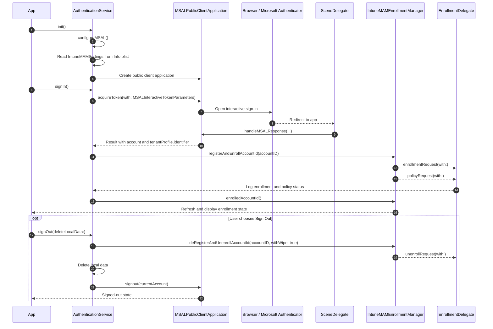

# IntuneSDKTest

A small Note taking SwiftUI app. The purpose for creating this app was 1. To learning how to integrate the Microsoft Authentication Library (MSAL) and Microsoft Intune App SDK for iOS, 2. To give Intune support engineers a reference on how these two libraries are used in an app, and 3. If someone has the requirements to compile the app they can use it as a test app. (Requirments are an Apple developer certificate to sign the app, and a MacBook that runs xcode).

## What is included

- Add, edit, and swipe-delete local notes.
- MSAL interactive sign-in with `User.Read`.
- MSAL broker callback handling for Microsoft Authenticator.
- Intune MAM enrollment after MSAL sign-in.
- In-app Intune diagnostic console for collecting SDK logs during testing.
- Optional Settings app toggle to show the Intune diagnostic console when the app launches.
- Account screen showing the current Intune enrollment state.
- Ordered Intune deregistration, selective wipe, and MSAL sign-out.
- Local JSON persistence using iOS file protection.
- Comments in `AuthenticationService.swift`, `SceneDelegate.swift`, and `NotesStore.swift` explaining the integration points.

The target is iOS 17+ because the current IntuneMAM Swift package requires iOS 17 or newer.

## Configure Entra ID

1. Register an app in **Microsoft Entra admin center > App registrations**.
2. Add the iOS platform with bundle ID `com.example.IntuneSDKTest`.
3. Confirm the redirect URI is `msauth.com.example.IntuneSDKTest://auth`.
4. Add delegated Microsoft Graph permission `User.Read`.
5. Add **APIs my organization uses > Microsoft Mobile Application Management > DeviceManagementManagedApps.ReadWrite**.
6. Grant admin consent if your tenant requires it.
7. Put the application (client) ID and directory (tenant) ID into `Info.plist`, replacing `YOUR_CLIENT_ID` and `YOUR_TENANT_ID`.

Do not put a client secret in an iOS app.

## Open and run

This repository includes `IntuneSDKTest.xcodeproj`. Open it on macOS with Xcode 16 or later, select an Apple development team, and let Swift Package Manager resolve:

- MSAL: `https://github.com/AzureAD/microsoft-authentication-library-for-objc`
- IntuneMAM: `https://github.com/microsoftconnect/ms-intune-app-sdk-ios`

The project links `MSAL` and `IntuneMAMSwift`. It also includes the Intune and MSAL shared keychain groups in `IntuneSDKTest.entitlements`.

Use a physical iPhone or iPad for broker and Intune policy testing. The Intune SDK can be linked successfully without a managed tenant, but policies and enrollment status require an Intune-licensed test user.

## Test Intune policy

1. In Intune admin center, create an iOS/iPadOS app protection policy.
2. Add this app as a custom app using the exact bundle ID.
3. Assign the policy to the test user.
4. Require an app PIN for an obvious first policy test.
5. Sign in to the app, wait for enrollment, and open **Account** to refresh the status.
6. Open **Account > Open diagnostic console** to review and share Intune logs when troubleshooting.
7. To open the console automatically when the app launches, enable **Settings > IntuneSDKTest > Show Intune diagnostics on launch**. Note, this will only work when signed out of app.
8. Create, edit, delete, and sign out to exercise the complete sample flow.

## Important files

- `AuthenticationService.swift`: MSAL setup, token acquisition, Intune enrollment, diagnostic console, and sign-out ordering.
- `SceneDelegate.swift`: required MSAL redirect callback and SwiftUI scene bridge.
- `Info.plist`: redirect URL, broker schemes, and `IntuneMAMSettings`.
- `IntuneSDKTest.entitlements`: MSAL and Intune shared keychain groups.
- `NotesStore.swift`: note CRUD and file-protected local persistence.
- `RootView.swift`: sign-in, notes list/editor, and enrollment UI.

## MSAL + Intune flow for support troubleshooting

The following diagram explains the end-to-end sequence in this sample app. It is useful for support engineers and for anyone learning why a sign-in, enrollment, or sign-out issue happens.

### What code accomplishes each step

1. App bootstrap and MSAL configuration
   - `AuthenticationService.init()` sets the Intune enrollment delegate and calls `configureMSAL()`.
   - `configureMSAL()` reads the `IntuneMAMSettings` values from `Info.plist` and creates the `MSALPublicClientApplication`.
   - This is the step where the app proves it can talk to Entra ID and is ready to request tokens.

2. User signs in with Microsoft
   - `AuthenticationService.signIn()` creates `MSALWebviewParameters` and `MSALInteractiveTokenParameters`.
   - It calls `msalApplication.acquireToken(with: parameters)` to open the interactive sign-in UI.
   - This is the point where the user authenticates and the access token is obtained.

3. Redirect callback from browser or Authenticator
   - `SceneDelegate.scene(_:openURLContexts:)` is required for iOS broker and browser redirects.
   - It calls `MSALPublicClientApplication.handleMSALResponse(...)` so MSAL can complete the sign-in and return the token result to the app.
   - If this callback is missing or incorrect, the login flow can look like it hangs or fails after consent.

4. Intune enrollment starts after a valid MSAL result
   - After the token result is returned, `AuthenticationService.signIn()` uses `result.tenantProfile.identifier` as the account ID.
   - It then calls `registerWithIntune(accountID:)`, which triggers `IntuneMAMEnrollmentManager.instance().registerAndEnrollAccountId(accountID)`.
   - This is the handoff from Microsoft identity to Intune app protection / MAM enrollment.

5. Intune policy and enrollment status updates
   - `EnrollmentDelegate` implements `enrollmentRequest(with:)`, `policyRequest(with:)`, and `unenrollRequest(with:)`.
   - These methods log the asynchronous Intune status codes and errors that appear while enrollment and policy evaluation complete.
   - If a policy is assigned to the user but not applied, this is the first area to check.

6. Refreshing the current state in the UI
   - `AuthenticationService.refreshEnrollment()` calls `IntuneMAMEnrollmentManager.instance().enrolledAccountId()`.
   - `RootView` uses the app state and enrollment values to show the current status in the Account screen.
   - This helps support verify whether the device actually completed Intune enrollment.

7. Sign out and cleanup order
   - `AuthenticationService.signOut(deleteLocalData:)` first calls `deRegisterAndUnenrollAccountId(accountID, withWipe: true)`.
   - It then deletes cached app data and finally calls `msalApplication.signout(...)`.
   - The ordering matters: Intune must be notified before the token is removed so it can finish unenrollment and selective wipe correctly.

### Quick troubleshooting checklist

- If the app cannot open sign-in: check `Info.plist` values, redirect URI, and the app registration in Entra ID.
- If sign-in completes but Intune never enrolls: verify the app registration and the user has the correct Intune policy assigned.
- If the redirect does not come back to the app: confirm `SceneDelegate` is present and `handleMSALResponse` is wired correctly.
- If sign-out fails: check whether `deRegisterAndUnenrollAccountId` is called before MSAL sign-out and whether the account is still available in cache.
- If policies are not applied: inspect the Intune enrollment delegate logs, open the Account screen's diagnostic console, and check the `enrolledAccountId()` status.

This is a learning sample, not a production-ready managed-data implementation. Production apps should add Intune enrollment/policy delegates, selective-wipe handling for every corporate data store, Conditional Access remediation, accessibility tests, and the current Intune iOS integration checklist. Set `VerboseLoggingEnabled` to `false` before shipping.
